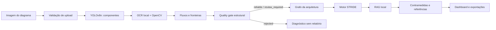

# ThreatLens AI


> Modelagem automática de ameaças STRIDE a partir de diagramas de arquitetura de software.

**Versão:** `1.0.0-mvp`

## Visão geral

O ThreatLens AI recebe um diagrama de arquitetura em imagem, identifica componentes de
software e nuvem com Visão Computacional e gera uma análise de ameaças baseada em STRIDE.

A solução não pede a um modelo generativo que invente um relatório diretamente da imagem.
Primeiro, a arquitetura é reconstruída de forma rastreável; somente depois o motor STRIDE,
a base de conhecimento local e o relatório são acionados.

O sistema entrega:

- componentes, tipo, provider, confiança e bounding box;
- fluxos, direção, protocolo e fronteiras de confiança;
- ameaças STRIDE rastreáveis por componente ou fluxo;
- contramedidas e referências CWE, CAPEC, OWASP e MITRE ATT&CK, quando aplicáveis;
- risco antes e depois das decisões de mitigação;
- exportações JSON, Markdown e PDF;
- quality gate que bloqueia relatórios baseados em reconstruções inconsistentes.

## Problema resolvido

A modelagem de ameaças a partir de diagramas é normalmente manual, consome tempo e depende
de experiência em segurança. O ThreatLens AI automatiza a primeira camada desse trabalho e
mantém revisão humana nos pontos em que a evidência visual não é suficiente.

```text
Imagem da arquitetura
-> detecção supervisionada de componentes
-> OCR e evidências visuais
-> reconstrução de fluxos e fronteiras
-> gate de qualidade estrutural
-> grafo de arquitetura revisável
-> motor STRIDE + RAG local
-> contramedidas e relatório rastreável
```

## Arquitetura da solução



### Status de qualidade

| Status | Comportamento |
| --- | --- |
| `reliable` | A análise pode seguir, mantendo revisão humana antes da aprovação final. |
| `review_required` | A análise é apresentada com alertas estruturais explícitos. |
| `rejected` | STRIDE, risco, relatório e PDF são bloqueados; diagnóstico e JSON permanecem disponíveis. |

O gate identifica diagramas com múltiplos painéis, duplicações suspeitas, agrupamentos
classificados como componentes, providers inconsistentes, self-loops sem evidência e
arestas direcionadas duplicadas.

## Dataset e treinamento

O dataset híbrido combina 300 diagramas do conjunto complementar do projeto com 73
arquiteturas independentes selecionadas do
[Software Architecture Dataset](https://www.kaggle.com/datasets/carlosrian/software-architecture-dataset).

O inventário remoto do Kaggle contém 8.700 imagens PNG, 8.700 anotações Pascal VOC e 852
famílias de arquiteturas. Para evitar vazamento entre splits, as augmentations foram
agrupadas pela arquitetura original e somente uma variante por grupo selecionado foi usada.

| Item | Quantidade |
| --- | ---: |
| Diagramas no dataset final | 373 |
| Objetos anotados | 3.048 |
| Classes canônicas | 14 |
| Treino | 265 imagens |
| Validação | 69 imagens |
| Teste | 39 imagens |

As classes são `api_gateway`, `backup`, `cdn`, `compute`, `database`,
`identity_provider`, `internet`, `load_balancer`, `monitoring`, `queue`, `secrets_kms`,
`storage`, `user` e `waf`.

O detector registrado é um YOLOv8n, treinado em resolução 640 com AdamW e replay
balanceado entre as fontes.

| Métrica do detector no teste híbrido | Resultado |
| --- | ---: |
| Precisão | 0,9297 |
| Recall | 0,8417 |
| mAP@50 | 0,9009 |
| mAP@50-95 | 0,8666 |

A avaliação ponta a ponta da v15 em `development_tuning` registrou:

| Métrica de ameaças | Resultado |
| --- | ---: |
| F1 | 0,5296 |
| Precisão | 0,4343 |
| Recall | 0,6786 |
| Ameaças corretas | 152 |
| Ameaças extras | 198 |

Esses números são evidência de desenvolvimento, não uma nova avaliação cega. Resultados
históricos e prospectivos permanecem separados e hash-selados em `data/results/`.

## Pré-requisitos

- Python 3.11 ou superior;
- Node.js 20 ou superior;
- Tesseract OCR;
- Docker Engine 24+ com Compose v2, opcional.

## Como executar

### Execução local

```powershell
# Execute na raiz do repositório.
python -m venv .venv
.venv\Scripts\python.exe -m pip install -r backend\requirements-lock.txt
Copy-Item .env.example .env
npm.cmd run dev
```

A aplicação abre em `http://127.0.0.1:4173`; o backend direto usa
`http://127.0.0.1:8000`.

### Execução com Docker

```bash
docker compose up --build
```

O runtime não precisa dos datasets usados no treinamento.

> O Docker é opcional. Para a apresentação em Windows, utilize a execução local acima;
> ela preserva o mesmo detector, RAG local e quality gate.

### Verificação completa

```powershell
.venv\Scripts\python.exe -m unittest discover -s tests -v
.venv\Scripts\python.exe scripts\build_reproducibility_manifest.py
.venv\Scripts\python.exe scripts\verify_project.py
```

## Exemplo de saída

```json
{
  "analysisQuality": {
    "status": "review_required",
    "score": 0.82,
    "reasons": [],
    "recommendedAction": "Revise os itens sinalizados antes de aceitar o relatório."
  },
  "architecture": {
    "components": [
      {
        "id": "api_1",
        "name": "API Gateway",
        "type": "api_gateway",
        "provider": "aws",
        "confidence": 0.91
      }
    ],
    "flows": [
      {
        "id": "flow_1",
        "from": "internet_1",
        "to": "api_1",
        "protocol": "HTTPS",
        "confidence": 0.84
      }
    ]
  },
  "threats": [
    {
      "stride": "Spoofing",
      "severity": "High",
      "componentId": "api_1",
      "evidence": "Endpoint exposto sem evidência explícita de autenticação.",
      "countermeasures": [
        "Implementar autenticação forte.",
        "Aplicar validação de token e rate limiting."
      ]
    }
  ]
}
```

## Tecnologias

- [Python](https://www.python.org/) e [FastAPI](https://fastapi.tiangolo.com/);
- [Ultralytics YOLOv8](https://docs.ultralytics.com/);
- [OpenCV](https://opencv.org/);
- [Tesseract OCR](https://github.com/tesseract-ocr/tesseract);
- [NetworkX](https://networkx.org/) para representação de grafos;
- RAG local com embeddings e fallback lexical determinístico;
- JavaScript, Node.js, HTML e CSS;
- Docker e Docker Compose;
- STRIDE, CWE, CAPEC, OWASP e MITRE ATT&CK.

## Diferenciais

- detector supervisionado treinado e registrado;
- rastreabilidade da imagem até a ameaça;
- separação entre hipótese visual, revisão humana e ameaça efetiva;
- quality gate fail-closed para impedir relatórios estruturalmente inválidos;
- execução local e gratuita por padrão;
- métricas, hashes, manifestos e auditorias reproduzíveis;
- estratégia `junction_aware_controlled` experimental, selecionável e reversível;
- 350 testes aprovados e verificador global em estado `PASS`.

## Documentação

- [Arquitetura e pipeline técnico](docs/architecture.md)
- [Desenvolvimento do modelo](docs/model-development.md)
- [Avaliação e métricas](docs/evaluation.md)
- [Contrato da API](docs/api-contract.md)
- [Limitações e uso responsável](docs/limitations.md)
- [Índice de evidências para entrega e demonstração](docs/submission-evidence.md)

## Licença e uso dos dados

O repositório ainda não possui uma licença de redistribuição definida. Os diagramas de
demonstração em `data/sample-diagrams/` foram gerados pelo projeto. O dataset Kaggle é uma
fonte opcional de treinamento e não é necessário para executar o MVP.
